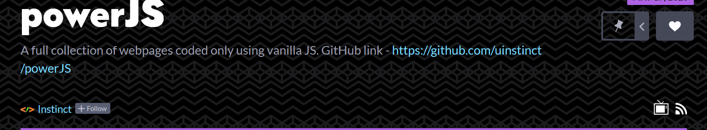

# powerJS

**This is an entire collection of webpages and js functionalities _(mainly consiting .html, .css and, .js files only)_.**

This is written entirely using vanilla javascript **without using any external libraries**.

The entire collection can be found on [this link](https://codepen.io/collection/XWdjWw) on codepen.io



## Contents

  1. [Drum Beat](https://codepen.io/uinstinct/pen/ExVQovR)
  2. [Clocking](https://codepen.io/uinstinct/pen/ZEbrvav)
  3. [Interactive Slider Change](https://codepen.io/uinstinct/details/eYpVyyV)
  4. [Array Exercise](/04/arrayExercise.js)
  5. [Flex Panel Gallery](https://codepen.io/uinstinct/details/eYpVyyV)
  6. [AJAX Filter](/06)
  7. [ArrayExcersie2](/07/arrayExercise2.html)
  8. [Canvas Draw](https://codepen.io/uinstinct/pen/gOavoyM)
  9. [Console Tricks](/09/consoleTools.html)
  10. [Checking Box](https://codepen.io/uinstinct/details/WNQMdBE)
  11. [Custom Video Play](https://codepen.io/uinstinct/pen/gOavvpL)
  12. [Detection Key Sequence](https://codepen.io/uinstinct/pen/xxwYpve)
  13. [Scroll Effect](https://codepen.io/uinstinct/pen/pojaazL)
  14. [Reference & Copy](/14)
  15. [Storing Locally](https://codepen.io/uinstinct/pen/ExVOxpp)
  16. [Text Shadow Mouse Move Effect](https://codepen.io/uinstinct/pen/OJyQQMm)
  17. [Sort Ignore](https://codepen.io/uinstinct/pen/zYvRRBX)
  18. [Total Time Calculated](https://codepen.io/uinstinct/pen/MWaQQbP)
  19. [CamBooth](https://codepen.io/uinstinct/pen/NWGOoJK)
  20. [Word Lister](https://codepen.io/uinstinct/pen/mdeQdzd)
  21. [Navigator Geolocation](https://codepen.io/uinstinct/pen/VwvVwEJ)
  22. [LinkTrace](https://codepen.io/uinstinct/pen/WNQMMRM)
  23. [Voice Bud](https://codepen.io/uinstinct/pen/pojaaeO)
  24. [Navigation Bar](https://codepen.io/uinstinct/pen/rNOJJGb)
  25. [Event Listener](/25/eventListener.html)
  26. [Popup Menu Follow](https://codepen.io/uinstinct/pen/BaoGabL)
  27. *pending*
  28. [UI Video Play](https://codepen.io/uinstinct/pen/JjYejVx)
  29. [Custom Countdown](https://codepen.io/uinstinct/pen/oNjapmY)
  30. [Smack a Rabbit](https://codepen.io/uinstinct/pen/WNQYeyV)

###### Note

Open 15 locally. LocalStorage might not be possible on codepen
Server is required for 19, 20
*I __recommend__ you to open these links in a __desktop__ or laptop and not a mobile device.*

## Local Setup

Although the entire collection can be found on [codepen](https://codepen.io/collection/XWdjWw), you may still want to *try it* on your local machine or *take it for development purposes.*

#### Software Requirements
- Browser *any* (Actually, that's all for most of it!)
- [NodeJS](https://nodejs.org)
- [Git](https://git-scm.com/)
- *Any* Preferred Editor

#### Command Run Through

Once you have *the above* requirements installed, you may now:

- Open the folder where you want this collection.
- Open your __terminal__ in *this folder*
- Now type or *just copy the below*
```
git clone https://github.com/uinstinct/powerJS.git
cd powerJS
code .
```

**Note** - *Please change `code .` to your preferred editor*

#### Server Requirement Setup

There are some projects like [CamBooth](/30) which require a server for secure origin.
*(You cannot simply allow webcam to run on file)*

For this, I suggest you to install [serve](https://www.npmjs.com/package/serve) which is an [npm](https://npmjs.com) package for serving local files.
You can do this simply by opening up your *__terminal__* and running :
`npm install -g serve`

In the project, where *a server is required*, just run `serve` in your *__terminal__*.

By default, the page will be served on [localhost:5000](http://localhost:5000).


## Contributing

This repository is welcome to all kinds of issuses and pull requests.

If you *find a bug* or *encounter a problem* anywhere, __draft an issue__ by [clicking here](https://github.com/uinstinct/powerJS/issues/new)

If you *made an improvement* or *resolved a problem*, you can send a **pull request** by creating it in *your forked repo* or by simply [clicking here](https://github.com/uinstinct/powerJS/pulls).

You will be soon notified once your issue or pull request is reviewed.


*If you liked my collection, you may give this repository a star by clicking above.*